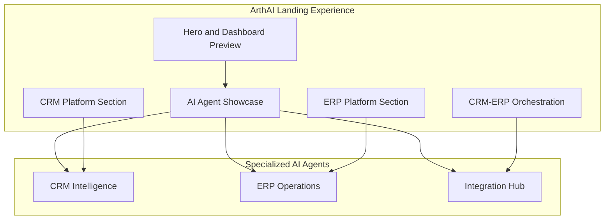

<div align="center">

# ArthAI

### Run your enterprise on intelligent automation

**One platform for CRM, ERP, and autonomous AI agents — built for teams that need speed, clarity, and room to scale.**

<br />

[](https://react.dev/)
[](https://www.typescriptlang.org/)
[](https://vite.dev/)
[](https://tailwindcss.com/)
[](https://www.framer.com/motion/)

<br />

[Live preview](#-quick-start) · [Features](#-what-makes-arthai-different) · [Tech stack](#-tech-stack) · [About the founder](#-about-the-founder)

</div>

---

## The problem

Most growing teams juggle **disconnected CRM tools**, **legacy ERP systems**, and **generic AI chatbots** that don't understand their workflows. Data lives in silos. Operations slow down. Automation becomes brittle.

**ArthAI** is designed to fix that — a unified, AI-native platform where customer-facing sales and back-office operations work together, orchestrated by specialized agents that actually know your business.

---

## What makes ArthAI different

| | Traditional stack | ArthAI |
|---|-------------------|--------|
| **CRM & ERP** | Separate vendors, manual sync | Unified platform, live CRM ↔ ERP sync |
| **AI** | Generic chatbots | Purpose-built agents for sales, finance, and ops |
| **Setup** | Months of integration work | Workflows live in days, not months |
| **Insights** | Static dashboards | Real-time recommendations your team can act on |

---

## Platform at a glance



---

## Features

### AI-native operations
- **CRM Intelligence** — lead scoring, pipeline automation, and AI-driven follow-ups
- **ERP Operations** — finance, HR, inventory, and procurement in one connected system
- **Integration Hub** — API gateway, cloud connectors, and real-time business intelligence

### Built for real teams
- **Rapid deployment** — go from setup to live workflows in days
- **How-it-works flow** — vision → setup → iterate → scale
- **Enterprise-grade stats** — uptime, automation efficiency, and scalability highlights

### Polished product experience
- **Custom design system** — ink + teal + coral palette (not a copy-paste SaaS template)
- **Interactive UI mockups** — sales pipeline, lead analytics, revenue dashboards, procurement flows
- **Responsive & animated** — mobile navigation, scroll reveals, and smooth transitions
- **Founder-led story** — authentic vision from Sunita Kumari, Founder

---

## Page sections

| Section | What it showcases |
|---------|-------------------|
| **Hero** | Value proposition + live dashboard preview |
| **Platform** | Workflow automation, guidance, and quality assurance |
| **AI Agents** | CRM, ERP, and Integration companions |
| **How it works** | 4-step path from vision to launch |
| **CRM showcase** | Pipeline UI, analytics, AI suggestions |
| **ERP showcase** | Revenue, workforce, procurement, inventory |
| **Architecture** | Unified CRM–ERP orchestration diagram |
| **Capabilities** | 6 feature pillars with detailed bullet points |
| **Founder** | Leadership note from Sunita Kumari |
| **Stats & CTA** | Key metrics and conversion footer |

---

## Tech stack

| Layer | Technology | Why |
|-------|------------|-----|
| **UI** | React 19 + TypeScript | Type-safe, component-driven architecture |
| **Build** | Vite 8 | Fast dev server and optimized production builds |
| **Styling** | Tailwind CSS 4 | Utility-first design tokens and responsive layout |
| **Motion** | Framer Motion | Scroll-triggered animations and micro-interactions |
| **Icons** | Lucide React | Consistent, lightweight iconography |

---

## Design philosophy

ArthAI's visual identity is intentionally distinct:

- **Ink (`#0c1222`)** — depth and focus for hero, process, and founder sections
- **Teal (`#0d9488`)** — trust, clarity, and primary actions
- **Coral (`#f97316`)** — energy and accent highlights
- **Plus Jakarta Sans** — modern, readable typography across all breakpoints

Every section was crafted to feel **purpose-built**, not templated.

---

## Quick start

### Prerequisites

- [Node.js](https://nodejs.org/) 18+ (20+ recommended)
- npm

### Install & run

```bash
# Clone the repository
git clone https://github.com/nandani013/ArthAI.git
cd ArthAI

# Install dependencies
npm install

# Start development server
npm run dev
```

Open **http://localhost:5173** in your browser.

### Other commands

```bash
npm run build    # Production build
npm run preview  # Preview production build locally
npm run lint     # Run ESLint
```

---

## Project structure

```
ArthAI/
├── public/                 # Static assets
├── src/
│   ├── App.tsx             # Page layout & section composition
│   ├── index.css           # Design tokens, theme, utilities
│   ├── main.tsx            # App entry point
│   └── components/
│       ├── Navbar.tsx      # Glass nav with mobile menu
│       ├── Hero.tsx        # Split hero + dashboard mockup
│       ├── FeatureStrip.tsx
│       ├── AgentShowcase.tsx
│       ├── HowItWorks.tsx
│       ├── CrmShowcase.tsx
│       ├── ErpShowcase.tsx
│       ├── IntegrationShowcase.tsx
│       ├── Features.tsx
│       ├── Testimonials.tsx
│       ├── Stats.tsx
│       └── Footer.tsx
├── index.html
├── package.json
└── vite.config.ts
```

---

## About the founder

> *"ArthAI was built to help teams run smarter operations — unifying CRM and ERP workflows with AI that learns how your business works. Our mission is to make enterprise automation accessible, reliable, and fast to deploy."*

**Sunita Kumari** — Founder, ArthAI

---

## Roadmap

- [ ] Backend API for CRM & ERP modules
- [ ] User authentication and role-based access
- [ ] Live AI agent orchestration dashboard
- [ ] Integration marketplace (Slack, Google Workspace, etc.)
- [ ] Multi-tenant deployment

---

## Contributing

This is currently a **private showcase project**. If you're interested in collaborating or have feedback, reach out via the repository issues or contact page.

---

## Repository

**GitHub:** [github.com/nandani013/ArthAI](https://github.com/nandani013/ArthAI)

---

<div align="center">

**Built with care by Sunita Kumari**

If this project resonates with you, consider giving it a star — it helps others discover ArthAI.

</div>
